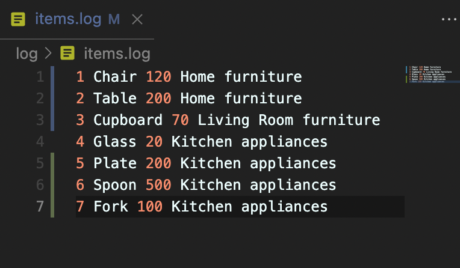
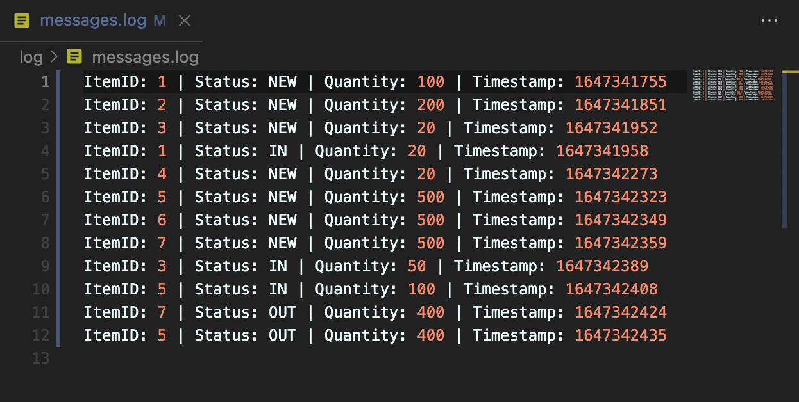

# Warehouse Logging Application

A warehouse logging application to record all in and outs of goods. Created using Haskell, this application is targeted for staff that manages inventory at some warehouses.

## Feature
1. Record inventory into database log

2. Record inventory activity in a log (e.g restocking and taking inventory)

## How to use
1. Install GHC, cabal-install and haskell-language-server via [GHCup](https://www.haskell.org/ghcup/)
2. Open terminal, and change directory to this project
3. Run `$ cabal build`
4. After it successfully built, run this project with `$ cabal run`